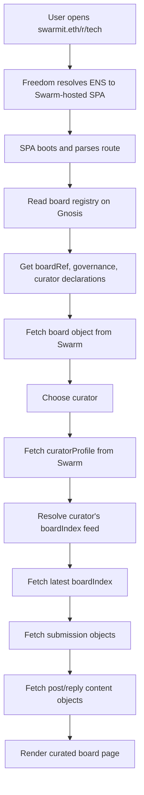
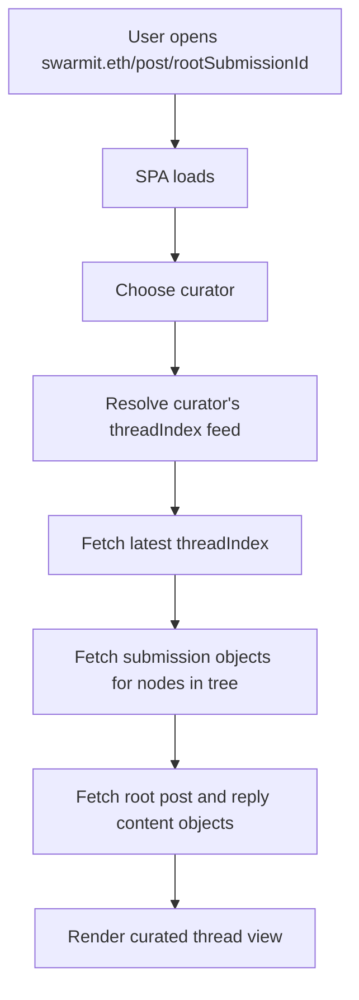
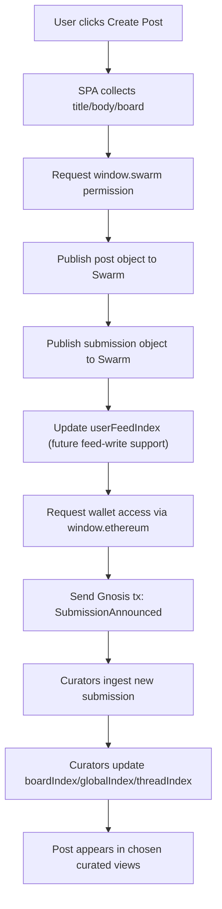
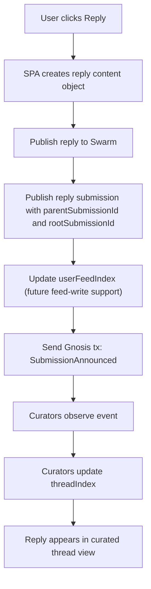

# Swarm Message Board Protocol Sketch

Date: 2026-03-17

This note sketches a concrete protocol for a Reddit-like message board built on top of:

- Swarm for content storage
- Swarm feeds for mutable views
- Gnosis Chain for public coordination, discovery, and governance

This is a protocol sketch, not an implementation spec. It is meant to clarify the object model and the division of labor between Swarm, feeds, curators, and chain.

## Executive Summary

The clean model is:

- immutable content lives on Swarm
- every submission is announced on Gnosis Chain
- users maintain their own author feeds
- curators build feed-backed front pages and thread views
- boards are distinct protocol objects, not just indexes
- there is no single canonical front page unless users choose one

The most important consequence is that `boardIndex`, `threadIndex`, and `globalIndex` are curator-scoped views, not singular shared truths.

In other words:

- `board` is the subreddit
- `submission` is the act of placing content into a board
- `post` and `reply` are immutable content objects
- `userFeedIndex` is the author's signed activity log
- `boardIndex` is a curator's board front page
- `threadIndex` is a curator's thread view
- `globalIndex` is a curator's cross-board front page

## Design Goals

- permissionless publishing of posts and replies
- censorship-resistant discovery of new submissions
- portable authorship and user history
- competing curators instead of one mandatory operator
- stable board and thread entrypoints via feeds
- moderation through omission, ranking, and labels rather than deletion
- optional governance via multisigs or DAOs without requiring every update to be a vote

## Layering

### Swarm

Swarm stores:

- posts
- replies
- submission objects
- board metadata
- curator metadata
- feed-backed indexes

Swarm is the content and state-distribution layer.

### Gnosis Chain

Gnosis stores:

- board registration
- submission announcements
- curator announcements
- optional moderation/governance decisions

Gnosis is the public coordination layer.

### Feeds

Feeds provide stable mutable pointers for:

- user activity streams
- board views
- thread views
- curator global front pages

Feeds are the mutable view layer on top of immutable content.

## Core Actors

### Author

A user who publishes posts and replies.

### Curator

A user, service, multisig, or DAO-controlled agent that watches on-chain submissions and publishes feed-backed views.

Examples:

- a board's official curator
- an alternative curator with different ranking rules
- a global front-page curator
- a thread-focused curator

### Board Governance

The human or machine-controlled authority attached to a board identity.

Examples:

- a single wallet
- a Safe
- a DAO

Governance can endorse default curators, update board metadata, and publish moderation policy, but it does not need to vote on every feed update.

### Indexer

A process that watches chain events and resolves Swarm objects and feeds. A curator usually runs an indexer, but public clients can also run lightweight indexing.

## Object Model

### Object Types At A Glance

| Object | Storage | Mutable | Writer | Purpose |
|---|---|---:|---|---|
| `board` | Swarm | No | board governance | Defines subreddit identity |
| `post` | Swarm | No | author | Immutable top-level content |
| `reply` | Swarm | No | author | Immutable reply content |
| `submission` | Swarm | No | author | Places content into a board |
| `userFeedIndex` | Swarm feed | Yes | author | Author's activity log |
| `boardIndex` | Swarm feed | Yes | curator | Curated board front page |
| `threadIndex` | Swarm feed | Yes | curator | Curated thread tree |
| `globalIndex` | Swarm feed | Yes | curator | Curated cross-board front page |
| `curatorProfile` | Swarm | No or feed-backed | curator | Describes curation identity and feeds |

## 1. `board`

`board` is the actual subreddit object.

It is separate from `boardIndex`.

It should contain:

- `boardId`
- `slug`
- `title`
- `description`
- `rulesRef`
- `createdAt`
- `governance`
- optional endorsed curators
- optional metadata feed for future updates

Example:

```json
{
  "protocol": "freedom-board/board/v0",
  "boardId": "tech",
  "slug": "tech",
  "title": "Technology",
  "description": "Posts about software, hardware, and networks",
  "rulesRef": "bzz://RULES_REF",
  "createdAt": 1773705600000,
  "governance": {
    "chainId": 100,
    "type": "safe",
    "address": "0xBoardSafe"
  },
  "endorsedCurators": [
    "0xCuratorA",
    "0xCuratorB"
  ]
}
```

## 2. `post`

`post` is immutable top-level content.

It should contain:

- `author`
- `title`
- `body`
- optional attachments
- `createdAt`

Example:

```json
{
  "protocol": "freedom-board/post/v0",
  "author": {
    "address": "0xAuthor",
    "userFeed": "swarm-feed://USER_FEED"
  },
  "title": "Hello Swarm",
  "body": {
    "kind": "markdown",
    "text": "First post"
  },
  "attachments": [],
  "createdAt": 1773705600000
}
```

## 3. `reply`

`reply` is immutable reply content.

It should contain:

- `author`
- `body`
- `createdAt`

The parent relationship should generally live in the `submission`, not only in the reply content, because board placement and thread placement are protocol-level concerns.

Example:

```json
{
  "protocol": "freedom-board/reply/v0",
  "author": {
    "address": "0xAuthor",
    "userFeed": "swarm-feed://USER_FEED"
  },
  "body": {
    "kind": "markdown",
    "text": "Interesting point"
  },
  "createdAt": 1773705700000
}
```

## 4. `submission`

`submission` is the key object that connects content to a board.

This is the protocol object that should be announced on-chain.

It should contain:

- `submissionId`
- `boardId`
- `kind` (`post` or `reply`)
- `contentRef`
- optional `parentSubmissionId`
- optional `rootSubmissionId`
- `author`
- `createdAt`
- optional board-specific metadata such as flair

Example:

```json
{
  "protocol": "freedom-board/submission/v0",
  "submissionId": "0xSUBMISSION_ID",
  "boardId": "tech",
  "kind": "reply",
  "contentRef": "bzz://REPLY_REF",
  "parentSubmissionId": "0xPARENT_SUBMISSION_ID",
  "rootSubmissionId": "0xROOT_SUBMISSION_ID",
  "author": {
    "address": "0xAuthor",
    "userFeed": "swarm-feed://USER_FEED"
  },
  "flair": null,
  "createdAt": 1773705700000
}
```

Why `submission` matters:

- the same post content can be cross-posted into multiple boards via multiple submissions
- board membership is explicit
- moderation acts on submissions, not on the raw content object
- chain announcements can point to one canonical protocol object

## 5. `userFeedIndex`

`userFeedIndex` is the author's mutable activity log.

It should contain recent authored refs, for example:

- post submissions
- reply submissions
- maybe standalone post/reply refs as a convenience

Example:

```json
{
  "protocol": "freedom-board/user-feed/v0",
  "author": "0xAuthor",
  "updatedAt": 1773705800000,
  "entries": [
    {
      "submissionId": "0xSUBMISSION_ID",
      "submissionRef": "bzz://SUBMISSION_REF",
      "kind": "reply",
      "boardId": "tech",
      "createdAt": 1773705700000
    }
  ]
}
```

This is the primary authorship view.

## 6. `boardIndex`

`boardIndex` is a curator-authored front page for a specific board.

This is not unique per board.

It is unique per `(boardId, curator)`.

It should contain:

- `boardId`
- `curator`
- `updatedAt`
- ordered `submissionId` or `submissionRef` entries
- optional ranking labels
- optional moderation labels

Example:

```json
{
  "protocol": "freedom-board/board-index/v0",
  "boardId": "tech",
  "curator": "0xCuratorA",
  "updatedAt": 1773705900000,
  "entries": [
    {
      "submissionId": "0xSUB1",
      "submissionRef": "bzz://SUB1_REF",
      "rank": 1,
      "labels": ["hot"]
    },
    {
      "submissionId": "0xSUB2",
      "submissionRef": "bzz://SUB2_REF",
      "rank": 2,
      "labels": []
    }
  ],
  "hidden": [
    {
      "submissionId": "0xSUB3",
      "reason": "spam"
    }
  ]
}
```

## 7. `threadIndex`

`threadIndex` is a curator-authored materialized conversation view.

This is also curator-scoped.

It is unique per `(rootSubmissionId, curator)`.

It should contain:

- `rootSubmissionId`
- `curator`
- reply edges
- reply ordering
- moderation labels

Example:

```json
{
  "protocol": "freedom-board/thread-index/v0",
  "rootSubmissionId": "0xROOT_SUBMISSION_ID",
  "curator": "0xCuratorA",
  "updatedAt": 1773706000000,
  "nodes": [
    {
      "submissionId": "0xROOT_SUBMISSION_ID",
      "parentSubmissionId": null,
      "depth": 0
    },
    {
      "submissionId": "0xREPLY1",
      "parentSubmissionId": "0xROOT_SUBMISSION_ID",
      "depth": 1
    },
    {
      "submissionId": "0xREPLY2",
      "parentSubmissionId": "0xREPLY1",
      "depth": 2
    }
  ],
  "hidden": []
}
```

## 8. `globalIndex`

`globalIndex` is a curator-authored cross-board front page.

It is unique per curator.

It should contain:

- `curator`
- `updatedAt`
- cross-board ranked submission entries

Example:

```json
{
  "protocol": "freedom-board/global-index/v0",
  "curator": "0xCuratorA",
  "updatedAt": 1773706100000,
  "entries": [
    {
      "boardId": "tech",
      "submissionId": "0xSUB1",
      "submissionRef": "bzz://SUB1_REF",
      "rank": 1
    },
    {
      "boardId": "music",
      "submissionId": "0xSUB9",
      "submissionRef": "bzz://SUB9_REF",
      "rank": 2
    }
  ]
}
```

## 9. `curatorProfile`

If we want competing curators to be first-class, we should model them explicitly.

`curatorProfile` should contain:

- curator address
- display name
- description
- curation policy
- feed addresses for `globalIndex`, per-board indexes, and per-thread indexes

Example:

```json
{
  "protocol": "freedom-board/curator/v0",
  "curator": "0xCuratorA",
  "name": "Freedom Default Curator",
  "description": "Spam-filtered chronological front pages",
  "policyRef": "bzz://POLICY_REF",
  "globalIndexFeed": "swarm-feed://GLOBAL_FEED",
  "boardFeeds": {
    "tech": "swarm-feed://TECH_BOARD_FEED",
    "music": "swarm-feed://MUSIC_BOARD_FEED"
  }
}
```

## On-Chain Protocol

### Core Principle

Every submission should be announced on-chain.

That gives us:

- public existence
- durable ordering
- censorship-resistant discovery
- a neutral stream any curator can follow

### Minimal Contract Surface

This can be one registry-style contract or a small set of contracts. The minimum useful event set is:

```solidity
event BoardRegistered(
  bytes32 indexed boardId,
  string slug,
  string boardRef,
  address governance
);

event SubmissionAnnounced(
  bytes32 indexed boardId,
  bytes32 indexed submissionId,
  string submissionRef,
  bytes32 parentSubmissionId,
  bytes32 rootSubmissionId,
  address author
);

event CuratorDeclared(
  bytes32 indexed boardId,
  address indexed curator,
  string curatorProfileRef
);

event ModerationDecision(
  bytes32 indexed boardId,
  bytes32 indexed submissionId,
  address indexed actor,
  uint8 action,
  string metadataRef
);
```

Notes:

- `BoardRegistered` creates the board identity.
- `SubmissionAnnounced` is the raw public bulletin board for curators and indexers.
- `CuratorDeclared` makes curator discovery easier.
- `ModerationDecision` is optional in v1; omission from curator indexes already provides practical moderation.

## What The Chain Should Not Store

The chain should not store:

- post bodies
- reply bodies
- media bytes
- full thread trees
- front-page ordering state

Those belong on Swarm and in feed-backed indexes.

## Feed Topology

A good mental model is:

- authors own `userFeedIndex`
- curators own `globalIndex`
- curators own `boardIndex` feeds per board
- curators own `threadIndex` feeds per root submission
- board governance may endorse one or more default curator feeds

This means the protocol has multiple simultaneous views:

- one raw public submission log on-chain
- many competing curated views on Swarm feeds

That is the core anti-centralization property.

## End-To-End Flow

## 1. Board creation

1. Board creator publishes the immutable `board` object to Swarm.
2. Board creator emits `BoardRegistered(boardId, boardRef, governance)` on Gnosis.
3. Optional: board governance emits or publishes endorsed curator profiles.

## 2. New top-level post

1. Author publishes immutable `post` to Swarm.
2. Author publishes immutable `submission` pointing to that post.
3. Author updates their `userFeedIndex`.
4. Author emits `SubmissionAnnounced` on Gnosis with the `submissionRef`.
5. Curators watching that board ingest the event and resolve the submission.
6. Each curator decides whether and how to include it in their `boardIndex`.
7. Global curators may also include it in their `globalIndex`.
8. Thread curators initialize a `threadIndex` for the root post if they choose to track it.

## 3. New reply

1. Author publishes immutable `reply` to Swarm.
2. Author publishes immutable `submission` with:
   - `kind = reply`
   - `parentSubmissionId`
   - `rootSubmissionId`
3. Author updates their `userFeedIndex`.
4. Author emits `SubmissionAnnounced` on Gnosis.
5. Curators watching the board or thread ingest the event.
6. Each curator decides whether and how to materialize the reply into their `threadIndex`.

## 4. Moderation

Moderation should mostly work by curated visibility, not deletion.

That means:

- content remains on Swarm
- submission announcements remain on-chain
- curators omit, label, or rank down submissions
- board governance may endorse moderation policies or specific curator sets

This gives us:

- censorship resistance at the existence layer
- moderation at the presentation layer

## Competing Curators

This is the crucial protocol property.

There should be no requirement that a board or the whole network has a single mandatory curator.

Instead:

- anyone can watch the on-chain submission stream
- anyone can publish a `curatorProfile`
- anyone can publish `boardIndex`, `threadIndex`, and `globalIndex` feeds
- users choose which curator they want to view

This means:

- the global front page can have multiple competing curators
- each board can have multiple competing curators
- the same thread can have multiple competing thread views

Board governance can still matter by endorsing defaults, but users are not forced into one view.

## Recommended Client Model

A client should let the user choose:

- a global curator
- optionally a per-board curator override
- optionally a per-thread curator override

Reasonable default behavior:

- use a trusted default global curator
- use a board-endorsed curator for that board
- let advanced users switch to any declared curator

This is similar to choosing relays, feeds, or moderation sets in other decentralized systems.

## Why This Is More Decentralized Than A Single Board Operator

Compared to a single board operator feed:

- raw submission discovery is public and neutral
- authorship lives with users via `userFeedIndex`
- any alternative curator can reconstruct the same board from chain + Swarm
- moderation becomes replaceable

The centralization that remains is mostly:

- who users trust as their default curators
- who they trust for spam filtering and ranking

That is a much healthier place to centralize than raw content existence.

## Role Of DAOs And Multisigs

Chain governance is most useful for:

- board registration and ownership
- moderator set management
- curator endorsement
- escalation and dispute handling

It is not necessary for:

- every ranking change
- every thread update
- every new front-page ordering

So the pragmatic recommendation is:

- multisig first
- DAO later if needed
- curator feeds update continuously
- governance only intervenes for durable policy and authority changes

## Application-Level Client Flow

This section describes how a real client application would use the protocol end to end.

The clean split is:

- the ENS name resolves to the app shell
- Gnosis provides coordination state
- Swarm provides content and metadata
- feeds provide the latest curated views

End users should normally consume curated views.

The raw on-chain submission log is primarily for:

- curators
- indexers
- alternative clients
- auditability

It is not the dominant end-user read path.

### 1. App shell load

Example:

- user opens `swarmit.eth`
- or `swarmit.eth/r/tech`
- or `swarmit.eth/post/0xROOT_SUBMISSION_ID`

Expected behavior:

1. Freedom resolves `swarmit.eth` to a Swarm-hosted SPA bundle.
2. The SPA boots with protocol constants such as:
   - Gnosis chain id
   - contract addresses
   - protocol version
3. The SPA parses the route and determines whether the user wants:
   - the global front page
   - a specific board
   - a specific thread

At this point the app shell is loaded, but no posts or replies have been materialized yet.

### 2. Read path: end users consume curator-backed views

For a board page like `swarmit.eth/r/tech`, the client should do this:

1. Read board registration data from Gnosis:
   - `boardId`
   - board metadata ref
   - governance address
   - declared or endorsed curators
2. Fetch the `board` object from Swarm.
3. Choose a curator:
   - user preference if present
   - otherwise a board-endorsed default
4. Fetch that curator's `curatorProfile` from Swarm.
5. Resolve the curator's `boardIndex` feed for `tech`.
6. Fetch the latest `boardIndex`.
7. Fetch the referenced `submission` objects from Swarm.
8. For each submission, fetch the referenced `post` or `reply` content object.
9. Render the page.

The same idea applies to:

- `globalIndex` for the global front page
- `threadIndex` for a specific thread
- `userFeedIndex` for an author's page

The client should be feed-first for reads, not chain-first.

### 3. What comes from chain vs Swarm

Chain should provide:

- board existence
- board governance
- curator declarations
- submission announcements
- durable ordering
- optional moderation/governance events

Swarm should provide:

- board metadata
- curator metadata
- posts
- replies
- submissions
- user activity feeds
- board views
- thread views
- global front pages

Feeds specifically provide the latest mutable curated state.

### 4. Board page load sequence



### 5. Thread page load sequence

For a thread page, the client should not reconstruct the conversation from raw chain events on every load.

Instead:

1. determine the root submission id from the route
2. choose a curator
3. resolve that curator's `threadIndex` feed for the root submission
4. fetch the latest `threadIndex`
5. fetch referenced `submission` objects
6. fetch referenced `post` and `reply` objects
7. render the tree



### 6. Optional live updates

Curators should watch the raw on-chain submission log continuously.

End-user clients have two reasonable options:

- simple mode:
  - read only the latest curator feeds
  - refresh periodically
- richer mode:
  - read curator feeds as the primary source of truth
  - also watch recent chain events and show uncurated items as pending or newly announced

The default UX should stay curator-first.

### 7. Publish flow

Publishing requires both Swarm and Gnosis.

The client should do this:

1. user writes a post or reply in the SPA
2. SPA requests `window.swarm` access if needed
3. SPA requests `window.ethereum` access if needed
4. SPA publishes immutable content to Swarm:
   - `post` or `reply`
5. SPA publishes the immutable `submission` object to Swarm
6. SPA updates the author's `userFeedIndex` once feed-write support exists
7. SPA sends a Gnosis transaction that emits `SubmissionAnnounced`
8. curators observe the event and update their `boardIndex`, `threadIndex`, and `globalIndex` feeds later

This is the key point:

- Swarm publish makes the content exist
- chain announcement makes the content discoverable

### 8. Post creation sequence



### 9. Reply creation sequence

Reply creation follows the same pattern, but the `submission` includes:

- `parentSubmissionId`
- `rootSubmissionId`

That gives curators enough information to rebuild thread trees.



### 10. Practical client stance

The intended client stance should be:

- feed-first for reads
- chain-backed for discovery and legitimacy
- Swarm-backed for content

That means:

- end users usually read curated feeds
- curators and indexers consume the raw chain log
- advanced users may optionally inspect the raw submission stream later

This keeps the default UX fast and understandable while preserving the anti-centralization properties of on-chain submission announcements.

## Open Questions

### 1. Spam resistance

If every submission is on-chain, cheap chain still allows cheap spam.

Possible mitigations:

- board-level staking
- rate limits at the client or curator level
- allowlists for some boards
- reputation systems
- economic friction via fees

### 2. Board metadata mutability

We need to decide whether `board` metadata is:

- immutable plus on-chain updates to a new `boardRef`
- or feed-backed from the start

The latter is probably cleaner if rules and descriptions are expected to change.

### 3. Curator discovery

We need to decide how users find curators.

Options:

- `CuratorDeclared` events
- board-endorsed curator lists
- ENS names
- out-of-band discovery

### 4. Identity model

A strong version of this protocol should use app-scoped feed identities for authorship.

Until then, authorship can rely on:

- EVM addresses in submission announcements
- optional user feed references

But feed-backed author identity is the cleaner long-term model.

### 5. Thread ownership

A thread does not naturally have one owner.

So `threadIndex` should probably always be treated as curator-owned, not as a single canonical thread state.

That matches the overall competing-curator model.

## Recommended Near-Term Path For Freedom

If Freedom eventually wants to support this protocol, the practical order is:

1. Finish feed-based mutable publishing and app-scoped publisher identities.
2. Add a simple board/submission object model on top of current Swarm publishing.
3. Add Gnosis announcement support for `SubmissionAnnounced`.
4. Build one default curator service or client-side curator mode.
5. Add curator switching in the UI later.

The right first target is not "fully decentralized Reddit."

The right first target is:

- Swarm content
- on-chain submission announcements
- one or a few curators
- user-selectable curation once the protocol stabilizes

That is realistic, useful, and aligned with Freedom's existing Swarm + Gnosis foundation.
